  <picture>
    <source media="(prefers-color-scheme: dark)" srcset="dark.svg">
    <source media="(prefers-color-scheme: light)" srcset="light.svg">
    
  </picture>

<!-- Centered, Cohesive Clickable Social Badges -->

  
  
  

<!-- Live Profile Indicators -->

  
  

---

## 🧠 About Me

<table align="center" width="100%">
  <tr>
    <td width="55%" valign="top">
      <h3>🚀 Core Focus & Philosophy</h3>
      
I am a passionate <b>AI & Computer Vision Engineer</b> and <b>Embedded Systems Developer</b>, bridging the gap between advanced cloud AI models and low-latency edge hardware. My mission is to build intelligent systems that see, understand, and interact with the physical world.

      <ul>
        <li>🔭 <b>Current Work:</b> Designing production-grade RAG pipelines, LLM fine-tuning, and multi-agent workflows using LangGraph and Ollama.</li>
        <li>🌱 <b>Exploring:</b> Machine learning observability (MLflow), agentic AI architectures, and optimized edge deployment.</li>
        <li>⚡ <b>Fun Fact:</b> I develop AI pipelines that run on drones, edge microcontrollers, and scaling cloud infrastructures.</li>
      </ul>
    </td>
    <td width="45%" valign="top">
      <h3>🎓 Education & History</h3>
      <ul>
        <li>🏫 <b>Bachelor of Engineering</b> in Electronics & Communication Engineering</li>
        <li>🏢 <b>Institution:</b> Dr. Mahalingam College of Engineering and Technology (2023–2027)</li>
        <li>📍 <b>Location:</b> Pollachi, Coimbatore, India</li>
        <li>💼 <b>Previous Internships:</b>
          <ul>
            <li>Electronics Intern @ Roots Industries</li>
            <li>PCB Design Intern @ MCET</li>
          </ul>
        </li>
      </ul>
    </td>
  </tr>
</table>

---

## 🛠️ Unified Technical Spectrum

I maintain a diverse set of skills spanning software engineering, data science, generative AI, and hardware design.

<table align="center" width="100%">
  <tr>
    <td width="50%" valign="top">
      <h4>🐍 Languages & Core</h4>
      
      
      
      
      
      
        
      <h4>🤖 AI, Machine Learning & Vision</h4>
      
      
      
      
      
      
    </td>
    <td width="50%" valign="top">
      <h4>🧩 Generative AI & Large Language Models</h4>
      
      
      
      
      
      
        
      <h4>🔌 Embedded Systems & Hardware</h4>
      
      
      
      
    </td>
  </tr>
  <tr>
    <td colspan="2">
      <h4>⚙️ Developer Tools, MLOps & Orchestration</h4>
      
      
      
      
      
      
      
    </td>
  </tr>
</table>

---

  

<i>Design Engineered & Managed by Suriya A</i>

